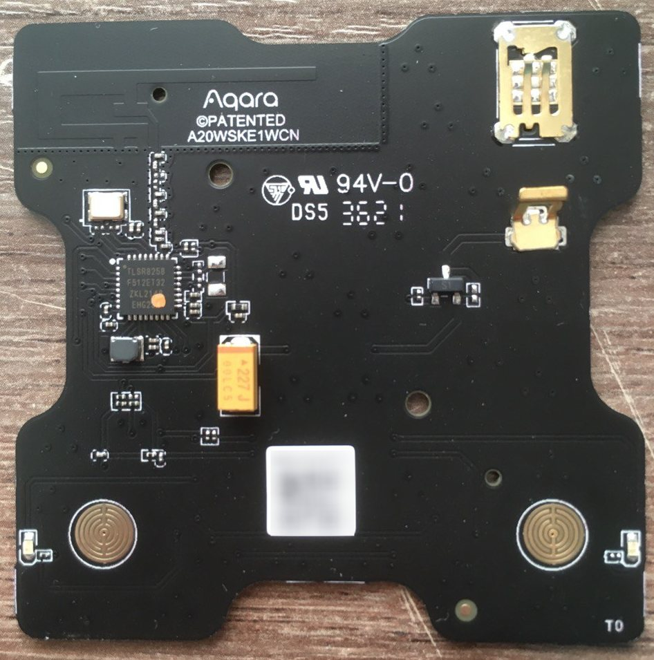
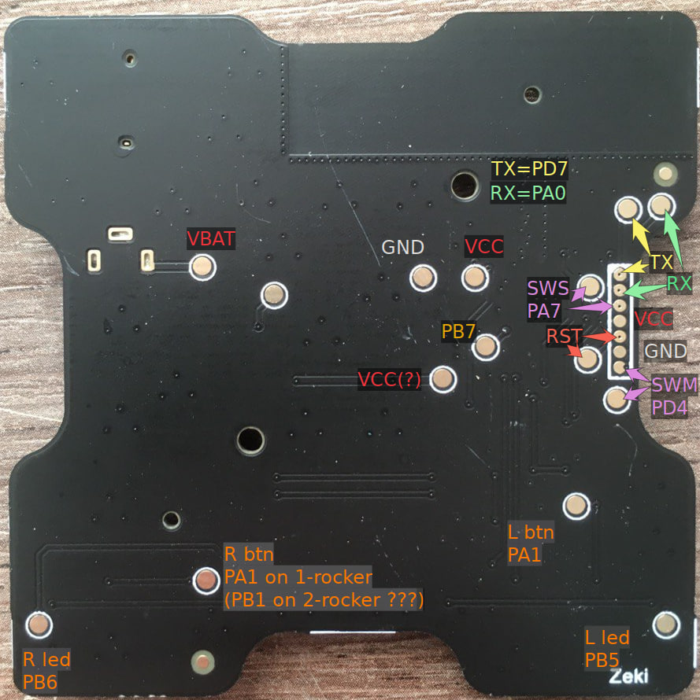

# Reverse engineering Aqara E1 wireless switch and E1 USB hub
Notes on reverse engineering some Aqara devices — wireless E1 mini switch and E1 USB hub  
Keywords: `lumi.remote.acn003`, `lumi.remote.acn004`, `WXKG16LM`, `WXKG17LM`, `aqara`, `switch`, `E1`, `wireless`, `tlsr8258`, `zigbee`  

## The problem and the task
I have a bunch of Aqara E1 switches (ones with relays and wireless ones) and I want to use Zigbee binding.  
Binding allows simple automations (this wireless switch controls that wired one) to work when hub is down (or there is interferention on coordinator).  
The original firmware does not support binding (you can bind, but switches ignore that), so I needed to use some custom firmware.  
FW development itself is a good task itself, and I used `simpleSwitch` demo from Telink Zigbee SDK with minimal modifications.  

 | 

I soldered some wires to one switch and was able to read the original firmware and write a custom one.  
[TLSRPGM](https://github.com/pvvx/TLSRPGM) after recompilation just works on TLSR8258 (e.g. EBYTE Z5812 module).  

I want to flash custom firmware using Zigbee OTA because I don't want to disassemble every switch and solder wires to it.  
So, OTA using z2m didn't just work. Logs showed the proper Manufacturer code and Image type, also current file version.  
Even with matching IDs the switch ignored OTA, so I supposed there is some manufacturer-specific magic and was going to investigate it.  

Also reverting to the original firmware via OTA would be great, and I didn't have an OTA image for that.

## What didn't work
At first I was going to sniff traffic in order to see how the proprietary hub does the OTA.  
I paired a switch and dumped flash contents (needed some tricks for that), compared it with clean dump and a dump when paired to my z2m with known key.  
So I got a network key and a channel. Later I discovered I could just check hub info in app for channel and sniff a join dialog for the key.  

There seemed to be few ways I possibly could see an OTA in action:
  * just native update (if there was a fresh FW from Xiaomi)
  * maybe my custom firmware could join the proprietary network and report an old version to get a current one
  * maybe I could modify the original dump to make it report an older version and receive an OTA

All that failed.
  * My switch had a fresh version (`0.0.0-0009`, file version 9)
  * The hub uses some crypted handshake when joining a device (some varying data to device and some varying data back) and didn't accept my firmware
  * I changed some bytes in original dump from 9 to 8, that changed a version z2m sees when attempting an OTA, but vendor app continued to report `0.0.0-0009` version

Also I took a risk of losing telnet and upgraded the hub (hoping it then would suggest a fresh FW for the switch). Still no update, but it took few hours for me to restore telnet.  
  * [Enable telnet by button clicks](https://github.com/niceboygithub/AqaraGateway/blob/master/README.md#manually-enable-telnet): 5-2-2-2-2-2 (led blinks green 2 times)
  * [Make telnet persistent](https://github.com/zvldz/aqcn02_fw/tree/main/update#the-easy-way) -- that also gives you `socat`

## Looking for other ways to attack the hub
So, if I could not hijack the Zigbee part, maybe I could interfere on the hub software on other level?  

There is a `miio_agent` on top of that which restart these processes if they die.  
Luckily, the software components have `--help` and allow verbose logging to a shell.  

First, I made `mZ3GatewayHost_MQTT` verbose and saw some proprietary stuff going between radio and MQTT.  
```shell
# killall -9 mZ3GatewayHost_MQTT; mZ3GatewayHost_MQTT -n 1 -b 115200 -p /dev/ttyS1 -d /data/ -r c
```
Then, I restarted the MQTT broker (Mosquitto) with verbose logging and saw the same traffic as events.  
```shell
# killall -9 mosquitto; mosquitto -v
```
`miio_client` also has quite interesting logs (lots of stuff) on many things.  
```shell
# killall -9 miio_client; miio_client -l0 -d /data/miio/ -n128
```
The connection to the cloud is protected (obviously), so before messing with TLS MITM, I concentrated on MQTT side.

### Version report in MQTT
I started socat as a TCP proxy `1884 -> localhost:1883`, connected with MQTT client (MQTTX in my case) and subscribed to the topics `miio_client` subscribes.  
Found lots of events, and payload in one of them was ending with `302E302E302D30303039` — which is the version `0.0.0-0009` shown by the app. Nice! Let's try to hijack that thing!  
Using the MQTTX I copy-pasted the original message and changed last char from 9 to 8. Et voilà! The app reported `0.0.0-0008` but still no update.  

I tried changing other bytes of that message but for no avail.  
Repeating that message on other handshake didn't work at all.  

Manual repeating was quite hard and unreliable, I wanted to modify the message on the fly.

### Spoofing the version in real time
I needed some way to modify the original message. I was thinking on some MQTT proxy between the vendor software and MQTT.  
I started Mosquitto on my laptop (allowing anonymous connections from external addresse),
restarted Mosquitto on the hub to listen on different port (to make supervisor happy),
used socat to forward traffic:  
```
# killall -9 mosquitto; mosquitto -p 1884 -d
# socat tcp-listen:1883,fork,reuseaddr tcp-connect:172.31.31.108:1883
```
The hub was still functioning, it was time to modify the message.  

The only proxy I could find was [Janus](https://github.com/phoenix-mstu/janus-mqtt-proxy), but I didn't figure out how to configure it.  
So I went with other option — run an MQTT broker I could easily hack. As I'm familiar with [Erlang](https://www.erlang.org/), I was looking for a broker in this language.  
[emqx](https://github.com/emqx/emqx) turned out to be a huge monstruosity, and I looked for something else.  
[VerneMQ](https://github.com/vernemq/vernemq) is much better for me. I started it and ensured the hub was still functional with it.  
I used `console` command to keep the broker in foreground and to have a shell:
```
$ make rel
$ cd $VERNEMQ/_build/default/rel/vernemq
$ bin/vernemq console
```

After reading the sources and tracing some calls I found VerneMQ has quite powerful [Webhooks](https://docs.vernemq.com/plugin-development/webhookplugins) — much easier for a one-off hack than a full native plugin.  
You may reuse my config `mqtt-mitm/vernemq.conf` or create your own.

A simple Flask/Python script — and I could not just view messages but modify their payloads.  
You can find the full script I used in `mqtt-mitm/webhook_verchange.py`, here is the main transformation:
```python
@api.route('/verchange', methods=['POST'])      
def verchange():      
    req = request.get_json(force=True)
    print(req)
    topic = req['topic']
    payload = json.loads(req['payload'])
    if (topic[0:3] == "gw/") and (topic[19:] == "/MessageReceived") and ('APSPlayload' in payload):               
        aps = payload['APSPlayload']
        if (aps[0:8] == "0x1D5F11") and (aps[20:42] == "0A302E302E305F30303039"):
            payload['APSPlayload'] = aps.replace('0A302E302E305F30303039', '0A302E302E305F30303031')
            return json.dumps({"result":"ok", "modifiers": {"payload": json.dumps(payload)}})
    return json.dumps({"result":"ok"})
```

I tried to guess the format of the version message. Some bytes looked like magic header, one byte was clearly a sequence number (that's why repeating on other handshake didn't work), `0A` looked like the string length, other ones maybe some numeric version and data tags and types.  

So I just matched the original version string in a payload of given length, replaced it with `0.0.0-0001` and… It works!  
The app showed my spoofd version and suggested an OTA to a `0.0.0-3`.  
Wait, but there is `0.0.0-9` already on my switch! OK, just let's see what happens.  

### Getting the outdated OTA
The update didn't work. I tried several times but to no avail. The progress starts and freezes at few percent.  
What's wrong?  
There was no file in `/data` (or I haven't noticed it), but definitely something was going on.  
I started `miio_client` again with verbose logging, retried the OTA and scrolled through the ton of logs, down to top.  
Here it downloads the update binary, well, here the progress is about 0%, and BINGO! Here is a download URL.  
I was able to `wget` the URL, but in a couple of minutes the url was dead.  
So, I finally had an OTA file for FW version `0.0.0-0003`.  

## Restoring the fresh OTA
I looked at `hexdump` of the `0.0.0-0003` OTA and fast-forwarded to the very end. It has some strings, some bytes, some `FF`s, 4 bytes of something like checksum and then EOF:  
```shell
0002b750  01 00 00 00 61 69 6f 74  2d 7a 69 67 62 65 65 33  |....aiot-zigbee3|
0002b760  2e 30 2d 61 75 74 68 00  6d 69 6f 74 2d 7a 69 67  |.0-auth.miot-zig|
0002b770  62 65 65 33 2e 30 2d 61  75 74 68 00 4d 19 01 00  |bee3.0-auth.M...|
0002b780  39 16 01 00 31 16 01 00  35 16 01 00 01 01 00 00  |9...1...5.......|
0002b790  02 00 00 00 03 00 00 00  06 00 00 00 05 00 00 00  |................|
0002b7a0  01 00 00 00 06 00 00 00  b4 7b 02 00 01 bc b2 02  |.........{......|
0002b7b0  00 04 9c b2 02 00 04 00  0b 3f 00 00 03 00 00 00  |.........?......|
0002b7c0  00 00 00 00 0b 2b 5f 11  65 34 01 00 00 00 5f 11  |.....+_.e4...._.|
0002b7d0  08 00 00 00 01 00 00 00  02 00 00 00 00 00 4c 55  |..............LU|
0002b7e0  4d 49 11 5f 41 51 41 52  41 2b 0b 00 00 00 00 00  |MI._AQARA+......|
0002b7f0  00 61 88 00 fe ca 00 00  01 00 24 00 1e 00 00 00  |.a........$.....|
0002b800  06 00 00 00 aa bb cc dd  ee ff 00 00 00 00 00 00  |................|
0002b810  00 00 00 00 00 00 00 00  00 00 00 00 00 00 00 00  |................|
*
0002b880  0c 00 00 00 ff 00 00 00  0b 00 00 00 fe ff 00 00  |................|
0002b890  58 02 84 03 97 04 01 00  80 00 00 00 ff ff ff ff  |X...............|
0002b8a0  9b 21 e9 2d                                       |.!.-|
0002b8a4
```
I opened the original flash dump, found a very similar part, and exported a range from the beginning to the checksum.  
```shell
00026c50  00 00 00 00 01 00 00 00  61 69 6f 74 2d 7a 69 67  |........aiot-zig|
00026c60  62 65 65 33 2e 30 2d 61  75 74 68 00 6d 69 6f 74  |bee3.0-auth.miot|
00026c70  2d 7a 69 67 62 65 65 33  2e 30 2d 61 75 74 68 00  |-zigbee3.0-auth.|
00026c80  0d 15 01 00 15 14 01 00  0d 14 01 00 11 14 01 00  |................|
00026c90  01 01 00 00 05 00 00 00  03 00 00 00 02 00 00 00  |................|
00026ca0  06 00 00 00 01 00 00 00  06 00 00 00 88 60 02 00  |.............`..|
00026cb0  01 48 67 02 00 04 28 67  02 00 04 00 0b 3f 00 00  |.Hg...(g.....?..|
00026cc0  07 00 00 00 00 00 00 00  0b 2b 5f 11 ed 22 01 00  |.........+_.."..|
00026cd0  00 00 5f 11 08 00 00 00  01 00 00 00 02 00 00 00  |.._.............|
00026ce0  00 00 4c 55 4d 49 11 5f  41 51 41 52 41 2b 0b 00  |..LUMI._AQARA+..|
00026cf0  00 00 00 00 00 61 88 00  fe ca 00 00 01 00 24 00  |.....a........$.|
00026d00  06 00 00 00 aa bb cc dd  ee ff 00 00 00 00 00 00  |................|
00026d10  00 00 00 00 00 00 00 00  00 00 00 00 00 00 00 00  |................|
*
00026d80  0c 00 00 00 ff 00 00 00  0b 00 00 00 fe ff 00 00  |................|
00026d90  58 02 84 03 97 04 01 00  80 00 00 00 ff ff ff ff  |X...............|
00026da0  cf 61 54 92 ff ff ff ff  ff ff ff ff ff ff ff ff  |.aT.............|
00026db0  ff ff ff ff ff ff ff ff  ff ff ff ff ff ff ff ff  |................|
*
```
Starting from `00040000` there is other firmware copy (one of them works, other is used for OTA). I exported that too.  
```shell
00067750  61 69 6f 74 2d 7a 69 67  62 65 65 33 2e 30 2d 61  |aiot-zigbee3.0-a|
00067760  75 74 68 00 6d 69 6f 74  2d 7a 69 67 62 65 65 33  |uth.miot-zigbee3|
00067770  2e 30 2d 61 75 74 68 00  35 26 01 00 3d 25 01 00  |.0-auth.5&..=%..|
00067780  35 25 01 00 39 25 01 00  01 01 00 00 05 00 00 00  |5%..9%..........|
00067790  03 00 00 00 02 00 00 00  06 00 00 00 01 00 00 00  |................|
000677a0  06 00 00 00 78 6b 02 00  01 4c 72 02 00 04 2c 72  |....xk...Lr...,r|
000677b0  02 00 04 00 0b 3f 00 00  09 00 00 00 00 00 00 00  |.....?..........|
000677c0  0b 2b 5f 11 0d 34 01 00  00 00 5f 11 08 00 00 00  |.+_..4...._.....|
000677d0  01 00 00 00 02 00 00 00  00 00 4c 55 4d 49 11 5f  |..........LUMI._|
000677e0  41 51 41 52 41 2b 0b 00  06 00 00 00 aa bb cc dd  |AQARA+..........|
000677f0  ee ff 00 00 00 00 00 00  00 00 00 00 00 00 00 00  |................|
00067800  00 00 00 00 00 00 00 00  00 00 00 00 00 00 00 00  |................|
*
00067860  00 00 00 00 00 00 00 00  00 00 00 00 00 61 88 00  |.............a..|
00067870  fe ca 00 00 01 00 24 00  0c 00 00 00 ff 00 00 00  |......$.........|
00067880  0b 00 00 00 fe ff 80 00  ff ff ff ff ff ff ff ff  |................|
00067890  c9 79 fb 46 ff ff ff ff  ff ff ff ff ff ff ff ff  |.y.F............|
000678a0  ff ff ff ff ff ff ff ff  ff ff ff ff ff ff ff ff  |................|
*
```

`make_ota.py` from [z03mmc project](https://github.com/devbis/z03mmc) handled all three files well. Time to try updating with z2m.  

## Messing with file versions
And as earlier the update did not work — the switch ignored the command. Also the hub itself could not apply the OTA. But it should work somehow!  
Maybe firmware ensures it is upgrading to the greater version. Maybe I could make the file look like a more fresh one?

Yes, I can!
  * `make_ota.py -v 13 lumi.remote.acn003-0003.bin`
  * `node scripts/add.js ../115f-2b0b-00000007-lumi.remote.acn003-0003.zigbee`
  * It upgrades!

So, if I change the version in an image header to 13, the firmware "upgrades" even from version 9 to version 3.  
It was surprising for me that version 3 I got from Xiaomi cloud is not accepted by the hub, but works well with z2m.  
There are no issues with a custom firmware, it may be downgraded to original FW.  

Now I can do OTA from original firmware to a custom one, then go back to original, using simple tools.  
TODO: merge with a more mature switch firmware, extend some tools.
